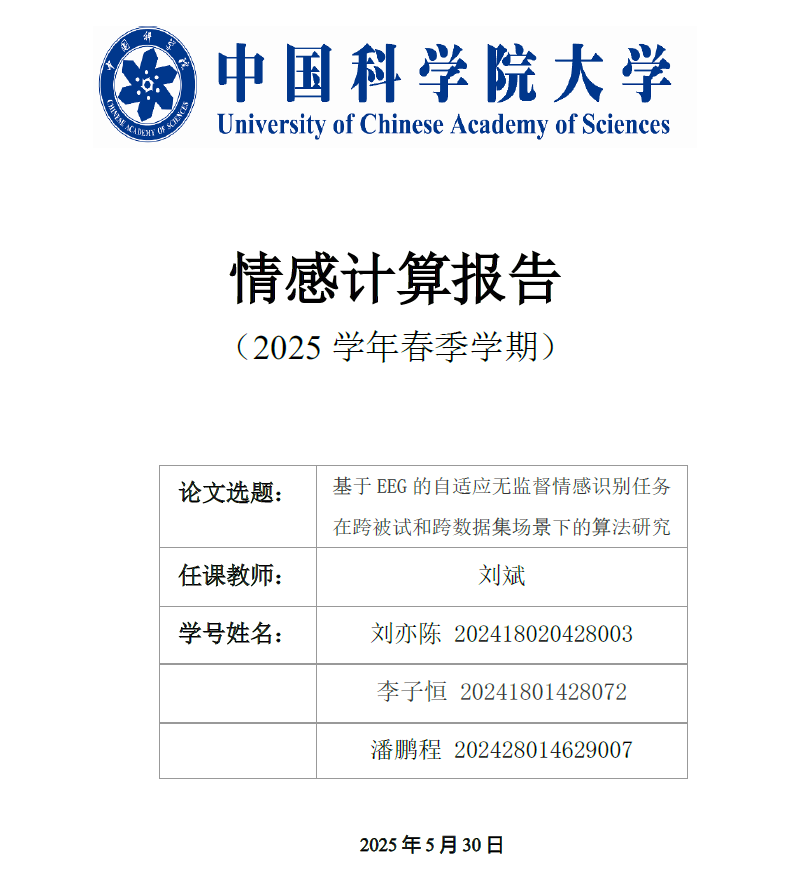

# 第6小组2025情感计算课程设计

本项目为第6小组2025情感计算课程设计：《基于EEG的自适应无监督情感识别任务在跨被试和跨数据集场景下的算法研究》的代码仓库。小组成员为潘鹏程、李子恒、刘亦陈。

## 课程设计报告

\
[查看完整 PDF](./Report/25AC_Report.pdf)
（Github有时在网页端无法正确加载pdf，请在链接转到的页面中点击Download raw file）

## 环境配置

实验在以下环境和软件包中进行：

- PyTorch == 2.3.1+cu121<br />
- Python == 3.10.12<br />
- NumPy == 1.26.4<br />
- pandas == 2.2.2<br />
- scikit-learn == 1.5.2<br />
- SciPy == 1.13.1

## 数据准备

1.	下载以下 EEG 数据集：<br />
    [DEAP](https://www.eecs.qmul.ac.uk/mmv/datasets/deap/download.html)<br />
    [SEED](https://bcmi.sjtu.edu.cn/home/seed/)<br />
2.	解压数据并按照以下目录结构进行组织，其中 _.npy_ 文件会随着代码运行自动生成，只需准备好 _.dat_ 文件和 _.mat_ 文件即可：<br />
```
    data
    +---DEAP
    ¦   ¦   sXX.dat
    ¦   +---preprocessed
    ¦           Data_Orig_sub_XX.npy
    ¦           DE_sub_XX.npy
    ¦           labels_sub_XX.npy
    ¦           PSD_sub_XX.npy       
    +---SEED
        ¦   label.mat
        ¦   X_1.mat
        ¦   X_2.mat
        ¦   X_3.mat 
        +---preprocessed
                Data_Orig_sub_X.npy
                DE_sub_X.npy
                labels_sub_X.npy
                PSD_sub_X.npy
```

preprocessed 目录用于存放代码预处理阶段生成的数据。

## 快速运行

运行 _main.py_ 即可重现结果。

## 更多功能

本项目实现了两种不同的迁移学习模式：跨数据集迁移（cross_dataset）和跨用户迁移（cross_subject）。通过命令行参数可以灵活切换这两种模式，实现不同场景下的情绪识别迁移学习。

## 模式说明

### 跨数据集模式 (cross_dataset)
- **源域**: SEED数据集
- **目标域**: DEAP数据集
- **应用场景**: 将模型从一个EEG情绪数据集迁移到另一个具有不同记录设备和实验范式的数据集
- **特点**: 解决跨数据集因采集设备、电极位置、实验任务不同带来的域漂移问题

### 跨用户模式 (cross_subject)
- **源域**: SEED数据集的部分用户数据
- **目标域**: SEED数据集未参与训练的其他用户数据
- **应用场景**: 适用于将模型训练在某些人的EEG数据上，然后应用到新用户身上
- **特点**: 解决不同人之间脑电信号模式差异导致的个体化问题

## 数据处理差异

两种模式下的数据处理存在一些关键差异：

1. **标签处理**:
   - SEED数据集: 原始标签为三分类（消极，中性，积极），通过筛选只保留标签为消极情绪和积极情绪的样本，转换为二分类（中性情绪难以定义）
   - DEAP数据集: 原始标签为连续值，根据4.5阈值将连续评分转换为二分类

2. **测试阶段**:
   - 跨数据集模式: 在DEAP数据集上测试，需要将连续标签转换为二分类
   - 跨用户模式: 在未参与训练的SEED用户数据上测试

## 使用方法

通过命令行参数`--mode`指定运行模式:

```bash
# 跨用户模式 (默认)
python main.py --mode cross_subject

# 跨数据集模式
python main.py --mode cross_dataset

# 带时间戳的运行
python main.py --mode cross_subject --timestamp 5_9_15_30

# 不挂断运行
nohup python main.py --mode cross_subject > /dev/null 2> ./output/txt/error.log &
```

